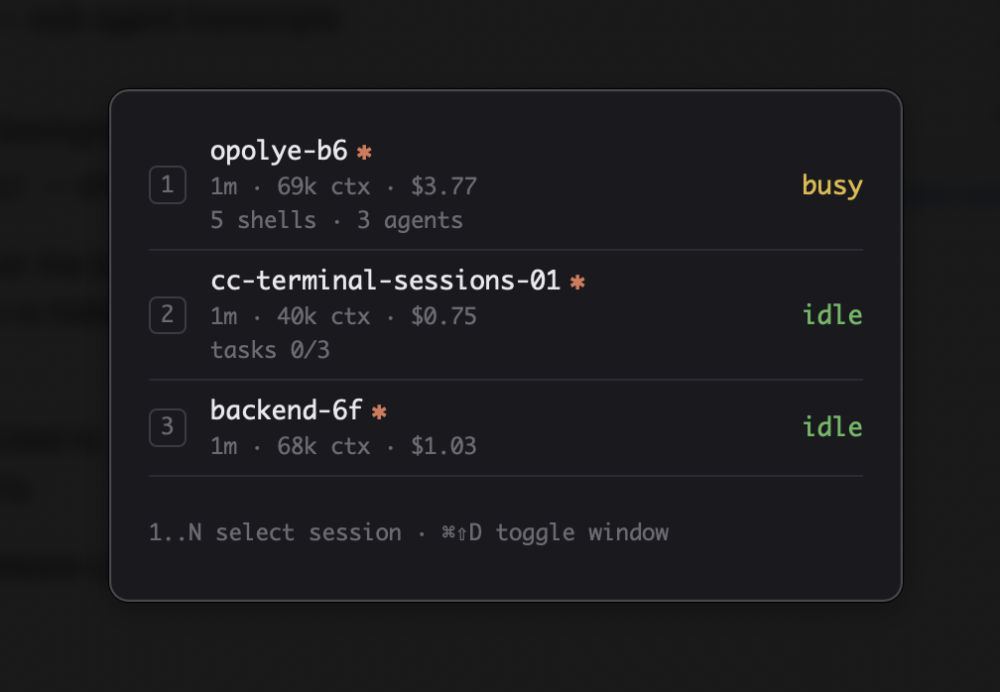

# cc-terminal-sessions

A tiny macOS heads-up display for your [Claude Code](https://code.claude.com)
terminal sessions. Summon it with a global hotkey, see every running session
at a glance, and jump straight to the Terminal tab a session lives in.



## Installing

1. Download the latest `.dmg` from the
   [Releases page](https://github.com/troelskn/cc-terminal-sessions/releases/latest):
   `…_aarch64.dmg` for Apple Silicon (M1 and later), `…_x64.dmg` for Intel Macs.
2. Open the DMG and drag `cc-terminal-sessions.app` to `/Applications`.
3. The build is unsigned, so macOS will refuse to open it the first time.
   Open it once, dismiss the warning, then go to **System Settings →
   Privacy & Security**, scroll down to the notice about
   `cc-terminal-sessions` and click **Open Anyway**. (On macOS 14 and
   earlier, right-clicking the app and choosing **Open** works too.) This is
   only needed once.
4. Launch it. Press **⌘⇧D** to toggle the panel. The first time you click a
   session to jump to its Terminal tab, macOS will ask for permission to
   control Terminal — allow it.

To have it start automatically when you log in, add it under **System
Settings → General → Login Items & Extensions → Open at Login** (click **+**
and pick the app from `/Applications`).

## Architecture

Built with Tauri v2 — a frameless, dark, auto-sizing panel with a TypeScript
frontend and a thin Rust backend.

The model layer polls two kinds of sources every 3 seconds and publishes to
the view only when something actually changed:

- `claude agents --json` — the documented-ish CLI surface: pid, cwd,
  session id, name, status.
- Claude Code's on-disk state — **undocumented internals**, read
  incrementally (byte offsets into append-only files, size/mtime caches for
  rewritable ones):
  - `~/.claude/projects/<slug>/<session>.jsonl` — transcripts, for context
    size (last usage block) and cost (accumulated usage × model rates)
  - `~/.claude/projects/<slug>/<session>/subagents/` — sub-agent transcripts
  - `~/.claude/tasks/<session>/` — task lists
  - `~/.claude/jobs/<id>/state.json` — live shell fan for background jobs
  - `/private/tmp/claude-<uid>/<slug>/<session>/tasks/` — shell output files

Sessions opened through the CLI's agents view are deduplicated: the
background continuation's transcript still references the original session
id, so the original interactive twin is hidden and its terminal is used as
the focus target.

The Rust side is deliberately small: run the CLI, list/read files (locked to
`~/.claude` and the claude temp dir), probe a process env, and AppleScript
Terminal.app to select a tab by tty.

Because most of this reads unstable internals, a Claude Code release can
break the detail rows at any time — the app degrades to the plain session
list when it does.

## Requirements

- macOS (Terminal.app for the focus-a-session feature; first use prompts
  for Automation permission)
- The `claude` CLI on your login shell's PATH
- Rust ≥ 1.77 and Node for development

## Building

`npm install && npm run bundle` produces a release build. The script detects
the machine's real architecture (via `sysctl`, so it isn't fooled by a
Rosetta shell) and runs `tauri build` for it; the finished app lands in
`src-tauri/target/<arch>-apple-darwin/release/bundle/macos/cc-terminal-sessions.app`
(a `.dmg` is written next to it). Drag the `.app` to `/Applications` — the
build is unsigned, so on first launch you may need to right-click → Open.

## Development

```bash
npm install
npm run tauri dev      # run the app with hot reload
npm run typecheck      # tsc
npm run bundle         # release build, see Building above
```

The app icon is generated from `src-tauri/icons/source.svg` via
`npx tauri icon <1024px png>`.

## Releasing

There is no CI; releases are cut from a local Apple Silicon machine (both
`aarch64` and `x86_64` rust targets must be installed via `rustup`).

1. Make sure `main` is up to date: `git pull --rebase origin main`.
2. Bump the version in `package.json`, `src-tauri/Cargo.toml` and
   `src-tauri/tauri.conf.json`, then refresh `Cargo.lock`:
   `(cd src-tauri && cargo update --workspace --offline)`.
3. Commit and tag: `git commit -am "Bump version to X.Y.Z" && git tag vX.Y.Z`.
4. Push: `git push origin main vX.Y.Z`.
5. Build both architectures:

   ```bash
   npm run bundle                              # aarch64 (host)
   npx tauri build --target x86_64-apple-darwin
   ```

   DMGs land in `src-tauri/target/<target>/release/bundle/dmg/`.
6. Create the GitHub release with both DMGs attached:

   ```bash
   gh release create vX.Y.Z --title vX.Y.Z --notes-file notes.md \
     src-tauri/target/aarch64-apple-darwin/release/bundle/dmg/cc-terminal-sessions_X.Y.Z_aarch64.dmg \
     src-tauri/target/x86_64-apple-darwin/release/bundle/dmg/cc-terminal-sessions_X.Y.Z_x64.dmg
   ```

   Release notes follow the format of previous releases (`gh release view`):
   a `## Changes` list, a `## Downloads` list naming which DMG is for Apple
   Silicon vs. Intel, and a reminder that builds are unsigned (right-click →
   Open on first launch).
